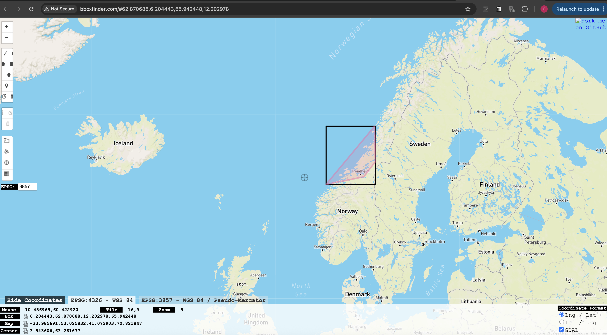

```{r setup, include=FALSE}
knitr::opts_chunk$set(echo = TRUE, warning = FALSE, message = FALSE)
library(DiagrammeR)
```

# Introduction

VAL_OTU_ID is a unified pipeline for validating eDNA metabarcoding taxonomy assignments. It addresses a fundamental limitation of standard taxonomy assignment tools like DADA2's `assignTaxonomy()`: **they ignore geographic context and reference database completeness**.

## The Problem

When DADA2 assigns taxonomy, it finds the best-matching sequence in the reference database. However, this is a sequence analysis exercise that ignores species ranges and potential downfalls of the completeness of the reference database, and interactions between these two facets:

1. **Geographic impossibility**: A species from the Pacific Ocean might be assigned to Atlantic samples simply because it's the best sequence match in the database
2. **Missing species**: The true local congener species might be absent from the reference database
3. **Database errors**: Reference sequences may be mislabeled or represent cryptic species

Species can also occur outside their established ranges if they are Invasive or Alien species (IAS). In the case of IAS, such validations may be confounded, so the algorithm to address this problem, described below, also checks validated identifications and original identifications against IAS databases and the IUCN red list database to flag any ASV/OTU identification that may warrant closer scrutiny.  

## A Validation Approach using GBIF and OBIS biodiversity records

VAL_OTU_ID validates each ASV/OTU assignment by:
 
1. **Checking geographic plausibility** against GBIF and OBIS occurrence records
2. **Re-evaluating sequence matches** against all congeners in the used reference database considering locally occurring congeners that may/may not be present in the reference database
3. **Verifying geographic status** of any potential reassignment target
4. **A combined decision making framework** that combine all sources of evidence to assign a final ASV/OTU identification
5. **Flagging any potential species of concern** by checking the validated identifications and original sequence identifications against online databases for species of conservation concern (IUCN red list) or IAS (GRIIS, GISD & GBIF species profiles).

# Pipeline Overview

## Input Requirements

1. **Taxonomy data**: Either a phyloseq `.rds` file or CSV with species assignments
2. **ASV sequences**: FASTA file (extracted automatically from `.rds`)
3. **Reference database**: MIDORI2 FASTA file
4. **Study area**: Bounding box coordinates (minLon, minLat, maxLon, maxLat)

Easiest use to get started is:
1. Get taxonomic assignments of ASVs/OTUs using a validated reference database (e.g. MIDORI or SILVA) and the assignTaxonomy() function in DADA2
2. Construct a phyloseq object with a minimum of the otu_table, tax_table, refseq slots filled

Alternatively, a csv file of the taxonomic assignment of each ASV/OTU and a fasta file of the the sequences of each ASV/OTU can be used. 

## Output Files

| File | Description |
|------|-------------|
| `*_geographic_validated.csv` | GBIF/OBIS occurrence results for each species |
| `*_database_validated.csv` | MIDORI2 sequence comparison results |
| `*_combined_decisions.csv` | Full results with decision logic |
| `*_phyloseq.csv` | Simplified output ready for R import |

---

# Step 1: Geographic Validation

## How It Works

For each unique species in your taxonomy, the pipeline queries GBIF and OBIS using a **tiered bounding box approach**:

The bounding box is defined for the study area and can be specified by the user

```{r geographic-tiers, echo=FALSE, fig.width=8, fig.height=7}
DiagrammeR::grViz("
digraph geographic_validation {
  graph [rankdir=TB, fontname='Helvetica', nodesep=0.25, ranksep=0.35]
  node [shape=box, style='filled,rounded', fontname='Helvetica', fontsize=14, margin='0.12,0.06']
  edge [fontname='Helvetica', fontsize=12, penwidth=1.3]
  
  start [label='Query GBIF/OBIS\\nfor species records', fillcolor='#E8F4FD', shape=ellipse, fontsize=14]
  
  tier1 [label='Records in study area?', fillcolor='#FFEAA7', shape=diamond, width=2]
  tier2 [label='Records in buffer zone?', fillcolor='#FFEAA7', shape=diamond, width=2]
  tier3 [label='Records in threshold zone?', fillcolor='#FFEAA7', shape=diamond, width=2.2]
  tier4 [label='Any global records?', fillcolor='#FFEAA7', shape=diamond, width=1.8]
  
  confirmed [label='CONFIRMED', fillcolor='#55EFC4', fontsize=14]
  plausible [label='PLAUSIBLE', fillcolor='#81ECEC', fontsize=14]
  possible [label='POSSIBLE', fillcolor='#74B9FF', fontsize=14]
  doubtful [label='DOUBTFUL', fillcolor='#FF7675', fontcolor='white', fontsize=14]
  no_records [label='NO_RECORDS', fillcolor='#636E72', fontcolor='white', fontsize=14]
  
  start -> tier1
  tier1 -> confirmed [label='YES']
  tier1 -> tier2 [label='NO']
  tier2 -> plausible [label='YES']
  tier2 -> tier3 [label='NO']
  tier3 -> possible [label='YES']
  tier3 -> tier4 [label='NO']
  tier4 -> doubtful [label='YES']
  tier4 -> no_records [label='NO']
}
")
```

## Geographic Assessment Categories

| Category | Definition | Implication |
|----------|------------|-------------|
| **CONFIRMED** | Records exist within the study area | Species occurs here - ID plausible |
| **PLAUSIBLE** | Records within buffer zone (default 500km) | Near known range - ID likely |
| **POSSIBLE** | Records within threshold (default 2000km) | Edge of range - needs scrutiny |
| **DOUBTFUL** | Nearest record beyond threshold | Likely misidentification |
| **NO_RECORDS** | No occurrence records found globally | Unknown species or data gap |

## Congener Search

For species that are **not CONFIRMED**, the pipeline also searches for congeners (same genus) in the study region. This information is used for:

- Deciding whether to **REASSIGN** to a local congener
- Applying **cf. notation** when only one local congener exists
- **DROP_TO_GENUS** when multiple local possibilities exist

---

# Step 2: Database Validation

## How It Works

For each ASV, the pipeline:

1. **Extracts the genus** from the DADA2 assignment
2. **Indexes all species of that genus** from MIDORI2
3. **Calculates sequence identity** between the ASV and all reference sequences
4. **Identifies the best-matching species**

## Sequence Identity Calculation

The pipeline uses three methods in order of preference:

1. **vsearch** (recommended) - Global pairwise alignment
2. **Biopython pairwise2** - Smith-Waterman local alignment
3. **K-mer Jaccard** (fallback) - Approximate similarity

> ⚠️ **Important**: Install vsearch for accurate results. K-mer similarity is NOT equivalent to true sequence identity.

## Database Validation Flags

| Flag | Definition |
|------|------------|
| **CONFIDENT** | Assigned species matches ≥99% |
| **LIKELY** | Assigned species matches well (97-99%) |
| **UNCERTAIN** | Some regional congeners missing from MIDORI2 |
| **REASSIGN** | A congener matches >0.5% better than assigned |
| **NO_REF** | Assigned species not in MIDORI2 |
| **NO_CONGENERS** | No other congeners in region (monotypic genus) |

---

# Step 3: Decision Logic

This is where the magic happens. The pipeline combines geographic and database evidence to make a final decision.

## Critical Rule: Geographic Verification for Reassignment

**The pipeline will ONLY reassign to a congener that is geographically CONFIRMED or PLAUSIBLE in your study area.**

This prevents incorrect reassignments where a non-local species happens to match better in the database. For example:

| Scenario | Assigned Species | Best DB Match | Result |
|----------|------------------|---------------|--------|
| Both local | *P. virens* (98.8%, CONFIRMED) | *P. pollachius* (100%, CONFIRMED) | REASSIGN to *P. pollachius* |
| Best match not local | *C. harengus* (98.8%, CONFIRMED) | *C. pallasii* (99.4%, NOT LOCAL) | KEEP *C. harengus* |
| Neither local | *P. stellatus* (97%, DOUBTFUL) | *P. flesus* (97.5%, CONFIRMED) | REASSIGN to *P. flesus* |

## Master Decision Flowchart

```{r decision-flowchart, echo=FALSE, fig.width=10, fig.height=11}
DiagrammeR::grViz("
digraph decision_tree {
  graph [rankdir=TB, fontname='Helvetica', nodesep=0.2, ranksep=0.3]
  node [shape=box, style='filled,rounded', fontname='Helvetica', fontsize=13, margin='0.1,0.05']
  edge [fontname='Helvetica', fontsize=11, penwidth=1.2]
  
  # Start
  start [label='START: ASV with taxonomy', fillcolor='#E8F4FD', shape=ellipse, fontsize=14]
  
  # Check 1
  check_sp [label='Has species-level ID?', fillcolor='#FFEAA7', shape=diamond, width=2]
  already [label='ALREADY_GENUS', fillcolor='#B2BEC3']
  
  # Check 2 - Ref. DB sequence check
  seq_ok [label='Ref. DB: Sequence ≥ min_species_pct?', fillcolor='#FFEAA7', shape=diamond, width=2.8]
  
  # Low seq - use rank for side placement
  drop_g1 [label='DROP_TO_GENUS', fillcolor='#FDCB6E']
  drop_f [label='DROP_TO_FAMILY', fillcolor='#E17055', fontcolor=white]
  drop_o [label='DROP_TO_ORDER', fillcolor='#D63031', fontcolor=white]
  
  # Check 3 - Ref. DB congener check
  db_chk [label='Ref. DB: Better-matching congener?', fillcolor='#FFEAA7', shape=diamond, width=2.8]
  
  # Two main branches - GBIF/OBIS checks
  geo [label='GBIF/OBIS: Geographic assessment?', fillcolor='#74B9FF', shape=diamond, width=2.6]
  cong_loc [label='GBIF/OBIS: Is congener local?', fillcolor='#74B9FF', shape=diamond, width=2.4]
  
  # Geo branch outcomes
  keep_hi [label='KEEP (high)', fillcolor='#00B894', fontcolor=white]
  keep_md [label='KEEP (medium)', fillcolor='#55EFC4']
  doubt [label='GBIF/OBIS: Local congeners exist?', fillcolor='#FFEAA7', shape=diamond, width=2.6]
  drop_g2 [label='DROP_TO_GENUS', fillcolor='#FDCB6E']
  
  # Congener branch - not local
  asgn_ok [label='Assigned sp. local (GBIF/OBIS)\\n& meets seq threshold (Ref. DB)?', fillcolor='#FFEAA7', shape=diamond, width=2.8]
  keep_nl [label='KEEP', fillcolor='#55EFC4']
  drop_g3 [label='DROP_TO_GENUS', fillcolor='#FDCB6E']
  
  # Congener branch - is local
  n_local [label='GBIF/OBIS: # local\\ncongeners?', fillcolor='#FFEAA7', shape=diamond, width=2]
  reass1 [label='REASSIGN', fillcolor='#00B894', fontcolor=white]
  pct_ok [label='Ref. DB: Seq diff\\n≥ reassign_diff_pct?', fillcolor='#FFEAA7', shape=diamond, width=2]
  reass2 [label='REASSIGN', fillcolor='#00B894', fontcolor=white]
  drop_g4 [label='DROP_TO_GENUS', fillcolor='#FDCB6E']
  
  # Layout hints
  {rank=same; already; seq_ok}
  {rank=same; drop_g1; drop_f; drop_o}
  {rank=same; geo; cong_loc}
  {rank=same; keep_hi; keep_md; asgn_ok; n_local}
  {rank=same; doubt; keep_nl; drop_g3; reass1; pct_ok}
  {rank=same; drop_g2; reass2; drop_g4}
  
  # EDGES
  start -> check_sp
  check_sp -> already [label='NO']
  check_sp -> seq_ok [label='YES']
  
  seq_ok -> drop_g1 [label='NO ≥90%']
  seq_ok -> drop_f [label='NO 80-90%']
  seq_ok -> drop_o [label='NO <80%']
  seq_ok -> db_chk [label='YES']
  
  db_chk -> geo [label='NO']
  db_chk -> cong_loc [label='YES']
  
  geo -> keep_hi [label='CONFIRMED ≥99%']
  geo -> keep_md [label='CONFIRMED/PLAUSIBLE']
  geo -> doubt [label='DOUBTFUL']
  doubt -> drop_g2 [label='YES']
  doubt -> drop_g1 [label='NO', style=dashed]
  
  cong_loc -> n_local [label='YES']
  cong_loc -> asgn_ok [label='NO']
  asgn_ok -> keep_nl [label='YES']
  asgn_ok -> drop_g3 [label='NO']
  
  n_local -> reass1 [label='1']
  n_local -> pct_ok [label='>1']
  pct_ok -> reass2 [label='YES']
  pct_ok -> drop_g4 [label='NO']
}
")
```

**Legend:** MIDORI2 = sequence reference database checks. GBIF/OBIS = geographic occurrence checks. Green = confident ID. Yellow = dropped to higher rank.

## Decision Categories Explained

### KEEP

The original DADA2 assignment is retained. This happens when:

- **Geographic CONFIRMED/PLAUSIBLE** + sequence identity ≥ min_species_pct
- A better-matching congener exists in MIDORI2 but is **NOT geographically local**
- Monotypic genus (no congeners to confuse with)

### REASSIGN

The ASV is reassigned to a different species. **This ONLY happens when:**

1. A congener matches the ASV **better** than the assigned species
2. **The target congener is geographically CONFIRMED or PLAUSIBLE**
3. The difference is ≥ `reassign_diff_pct` (default 0.5%) OR it's the only local congener

### DROP_TO_GENUS

The species-level ID is removed, keeping only genus. Output shows `Genus` or `Genus sp. cf. species`. This happens when:

- Sequence identity < min_species_pct
- Geographic assessment is DOUBTFUL with local congeners present
- Multiple local congeners match similarly well (ambiguous)
- Database validation is UNCERTAIN

### DROP_TO_FAMILY / DROP_TO_ORDER

Rare cases where sequence identity is too low for genus-level confidence.

---

# The cf. Notation System

## What is cf.?

`cf.` (Latin: *confer*, meaning "compare with") indicates uncertainty at the species level while suggesting the most likely identity.

**Format:** `Genus sp. cf. epithet`

**Example:** `Platichthys sp. cf. flesus`

This means: "A *Platichthys* species, probably *flesus* but not confirmed"

## When is cf. Used?

```{r cf-notation, echo=FALSE, fig.width=7, fig.height=5}
DiagrammeR::grViz("
digraph cf_notation {
  graph [rankdir=TB, fontname='Helvetica', nodesep=0.25, ranksep=0.35]
  node [shape=box, style='filled,rounded', fontname='Helvetica', fontsize=14, margin='0.12,0.06']
  edge [fontname='Helvetica', fontsize=12, penwidth=1.3]
  
  start [label='Decision: DROP_TO_GENUS', fillcolor='#E8F4FD', shape=ellipse]
  single [label='GBIF/OBIS: Only 1 local congener?', fillcolor='#FFEAA7', shape=diamond, width=2.6]
  match [label='MIDORI2: Seq match ≥ cf_threshold_pct?', fillcolor='#FFEAA7', shape=diamond, width=2.8]
  cf [label='Genus sp. cf. species', fillcolor='#55EFC4', fontsize=14]
  no_cf [label='Genus only', fillcolor='#FDCB6E', fontsize=14]
  
  {rank=same; cf; no_cf}
  
  start -> single
  single -> match [label='YES']
  single -> no_cf [label='NO (0 or >1)']
  match -> cf [label='YES']
  match -> no_cf [label='NO']
}
")
```

**Conditions for cf. notation:**

1. Only ONE congener is geographically local (CONFIRMED/PLAUSIBLE)
2. Sequence identity to that congener ≥ cf_threshold_pct (default 97%)
3. Decision is DROP_TO_GENUS (not KEEP or REASSIGN)

---

# Configurable Parameters

## Required Parameters

| Parameter | Description |
|-----------|-------------|
| `--input`, `-i` | Phyloseq `.rds` file OR base name of `_taxonomy.csv`/`_sequences.fasta` |
| `--midori`, `-m` | MIDORI2 reference FASTA (filename or full path) |
| `--bbox`, `-b` | Study area bounding box: `minLon minLat maxLon maxLat` |

## Input/Output Options

| Parameter | Default | Description |
|-----------|---------|-------------|
| `--taxonomy`, `-t` | - | Full path to taxonomy CSV (alternative to --input) |
| `--sequences`, `-s` | - | Full path to sequences FASTA (alternative to --input) |
| `--species-column`, `-c` | `species_raw` | Column name containing species names |
| `--output-dir`, `-o` | `results_files` | Output directory |
| `--starting-dir` | `starting_files` | Directory for input files when using --input |
| `--reference-dir` | `Reference_databases` | Directory for MIDORI2 when filename only given |

## Geographic Validation Parameters

| Parameter | Default | Description |
|-----------|---------|-------------|
| `--buffer-km` | 500 | Buffer around study area for "PLAUSIBLE" classification |
| `--distance-threshold-km` | 2000 | Maximum distance for "POSSIBLE" classification |
| `--congener-search-km` | 2000 | Search area expansion for finding congeners |

## Sequence Identity Thresholds

| Parameter | Default | Description |
|-----------|---------|-------------|
| `--min-species-pct` | 97.0 | Minimum % identity for species-level ID |
| `--min-genus-pct` | 90.0 | Minimum % identity for genus-level ID |
| `--min-family-pct` | 80.0 | Minimum % identity for family-level ID |
| `--cf-threshold-pct` | 97.0 | Minimum % identity for `sp. cf.` notation |
| `--reassign-diff-pct` | 0.5 | Minimum % difference to reassign when multiple local congeners |

## API and Performance Settings

| Parameter | Default | Description |
|-----------|---------|-------------|
| `--max-concurrent` | 10 | Maximum concurrent API requests |
| `--worms-rate-limit` | 0.1 | Seconds between WoRMS requests |

## Sequence Comparison Settings

| Parameter | Default | Description |
|-----------|---------|-------------|
| `--kmer-size` | 15 | K-mer size for sequence comparison fallback |
| `--vsearch-path` | `vsearch` | Path to vsearch executable if installed |

## Conservation and Invasive Species Settings

These are **optional** checks that can be enabled with flags:

| Parameter | Description |
|-----------|-------------|
| `--check-iucn` | Enable IUCN Red List status checking |
| `--check-invasive` | Enable invasive species checking via GBIF/GRIIS |

### IUCN API Token Setup

To use `--check-iucn`, you need a free API token:

1. Register at https://apiv3.iucnredlist.org/
2. Create a text file: `starting_files/iucn_api_token.txt`
3. Paste your token (just the token string, nothing else)

The pipeline will automatically read the token from this file.

### Data Sources

**IUCN Red List:** Official conservation status from the International Union for Conservation of Nature.

**Invasive species:** Checked against:

- **GRIIS** (Global Register of Introduced and Invasive Species)
- **GISD** (Global Invasive Species Database)
- **GBIF species profiles** (establishment means)

### Handling of cf. Notation and Original Species

**Lookup species:** Conservation status is checked against `species_final_redund` — the validated final species name with trailing numbers removed.

**cf. notation:** For species like "Platichthys sp. cf. flesus", the pipeline extracts the implied species by removing the "sp. cf." portion:

- "Platichthys sp. cf. flesus" → queries "Platichthys flesus"
- "Sebastes sp. cf. norvegicus" → queries "Sebastes norvegicus"

**Original DADA2 assignment:** The original species assignment is ALWAYS checked, regardless of the validation decision:

- The **final** species → stored in `iucn_category`, `invasive_status`
- The **original** DADA2 species → stored in `iucn_category_original`, `invasive_status_original`

This is important because:

- If Sus scrofa (invasive) is dropped to genus "Sus", we still flag it as invasive via `invasive_status_original`
- If a threatened species is reassigned to a common congener, we still capture the threat status

The `species_concern_flag` reflects whether EITHER the final OR original species is threatened/invasive — so you never miss important conservation information.

## Setting Thresholds by Amplicon Length

The sequence identity thresholds should be adjusted based on your amplicon length. A single nucleotide difference has different percentage impacts:

| Amplicon | ~Length | 1 nucleotide = | Suggested min_species_pct | Suggested reassign_diff_pct |
|----------|---------|----------------|---------------------------|----------------------------|
| MiFish 12S | 170bp | ~0.6% | 97-98% | 0.5-0.6% |
| 16S V4 | 300bp | ~0.3% | 97% | 0.3-0.4% |
| COI Leray | 313bp | ~0.3% | 97% | 0.3% |
| COI Folmer | 658bp | ~0.15% | 97-98% | 0.15-0.2% |

---

# Complete Example Workflow

## 1. Prepare Your Data

Download the repo locally and place your starting files (either your phyloseq object saved as a .rds file, or your starting ASV/OTU .csv taxonomy and .fasta sequence files) in the "starting_files" directory inside the repo. 

```bash
# Directory structure
VAL_OTU/
├── VAL_OTU_ID.py
├── starting_files/
│   ├── ps_fish.rds
│   └── iucn_api_token.txt      # Optional: for --check-iucn
├── Reference_databases/
│   └── MIDORI2_UNIQ_NUC_GB268_srRNA_DADA2.fasta
└── results_files/
```

## 2. Find Your Bounding Box

Use [bboxfinder.com](http://bboxfinder.com) to draw your study area and get coordinates.

**Example for Trondheimsfjorden on the mid-Norwegian coast:**
```
minLon: 6
minLat: 63
maxLon: 12
maxLat: 66
```

```{r bbox-example, echo=FALSE, out.width="80%", fig.cap="Example bounding box selection using bboxfinder.com"}

```

## 3. Run the Pipeline

```bash
python VAL_OTU_ID.py \
    --input ps_fish.rds \
    --midori MIDORI2_UNIQ_NUC_GB268_srRNA_DADA2.fasta \
    --bbox 6 63 12 66 \
    --min-species-pct 98 \
    --min-genus-pct 92 \
    --buffer-km 300
```

### With Conservation and Invasive Species Checking

```bash
python VAL_OTU_ID.py \
    --input ps_fish.rds \
    --midori MIDORI2_UNIQ_NUC_GB268_srRNA_DADA2.fasta \
    --bbox 6 63 12 66 \
    --check-iucn \
    --check-invasive
```

> **Note:** For `--check-iucn`, place your IUCN API token in `starting_files/iucn_api_token.txt`

## 4. Import Results to R

```{r eval=FALSE}
library(phyloseq)

# Load original phyloseq
ps <- readRDS("starting_files/ps_fish.rds")

# Read validated taxonomy
validated <- read.csv("results_files/ps_fish_phyloseq.csv")
rownames(validated) <- validated$ASV_ID

# Check decision distribution
table(validated$validation_decision)

# Filter to confident IDs only
confident <- validated[validated$validation_decision == "KEEP", ]

# Update taxonomy in phyloseq
# (keeping only rows that match)
keep_asvs <- rownames(validated)[validated$validation_decision == "KEEP"]
ps_validated <- prune_taxa(keep_asvs, ps)

# Or update all taxonomy with validated decisions
new_tax <- validated[, c("kingdom", "phylum", "class", "order", 
                          "family", "genus", "species_final")]
rownames(new_tax) <- validated$ASV_ID
tax_table(ps) <- tax_table(as.matrix(new_tax))
```

---

# Interpreting Results

## Output Column Descriptions

### `_phyloseq.csv` columns:

| Column | Description |
|--------|-------------|
| `ASV_ID` | Unique identifier for each ASV |
| `kingdom` through `genus` | Higher taxonomy (unchanged from DADA2) |
| `species_final` | Validated species with unique number for each ASV/OTU (e.g., "Gadus morhua 3") |
| `species_final_collapse` | Species without number (for aggregating replicates) |
| `species_final_redund` | Species name with trailing number stripped (for grouping) |
| `species_original` | Original DADA2 assignment |
| `habitat` | marine/freshwater/brackish/terrestrial (from WoRMS) |
| `validation_decision` | KEEP/REASSIGN/DROP_TO_GENUS/etc. |
| `decision_reason` | Human-readable explanation |
| `best_db_match` | Best matching species in MIDORI2 |
| `best_db_match_pct` | % identity to best match |
| `iucn_category` | IUCN Red List category for final species. For cf. species, queries the implied species. |
| `iucn_population_trend` | Population trend from IUCN |
| `invasive_status` | Invasive status for final species: INVASIVE/INTRODUCED/NOT_LISTED |
| `iucn_category_original` | IUCN category for original DADA2 assignment (all species-level assignments) |
| `invasive_status_original` | Invasive status for original DADA2 assignment (all species-level assignments) |
| `species_concern_flag` | Summary considering BOTH final and original: THREATENED, INVASIVE, THREATENED+INVASIVE, or NONE |

### IUCN Red List Categories

| Code | Meaning |
|------|---------|
| CR | Critically Endangered |
| EN | Endangered |
| VU | Vulnerable |
| NT | Near Threatened |
| LC | Least Concern |
| DD | Data Deficient |
| NE | Not Evaluated (species not in IUCN database) |
| NA | Not Available (query error) |
| NOT_CHECKED | `--check-iucn` not specified |

### Invasive Species Status

| Status | Meaning |
|--------|---------|
| INVASIVE | Listed in GRIIS or GISD as invasive |
| INTRODUCED | Listed as introduced/alien species |
| NOT_LISTED | Not found in invasive species databases |
| NA | Query error |
| NOT_CHECKED | `--check-invasive` not specified |

## Common Decision Reasons

| Reason | Interpretation |
|--------|----------------|
| "Geographic CONFIRMED + sequence match (99.5%)" | High confidence - species confirmed |
| "Geographic CONFIRMED but sequence only 95.3% (below 98.0% threshold)" | Good location but poor sequence match - dropped to genus |
| "Local congener P. pollachius (100.0%) matches better than assigned (98.8%)" | Reassigned to better-matching local species |
| "Better DB match (C. pallasii 99.4%) not local; keeping 98.8% match" | Better match exists but isn't local - kept original |
| "Only 1 local congener (P. flesus); sequence 97.5% - cf. notation" | Probable species but uncertain - cf. applied |
| "Geographic DOUBTFUL with 3 local congener(s)" | Wrong species likely - dropped to genus |
| "Multiple local congeners, matches too similar (98.8% vs 99.1%)" | Too close to call - dropped to genus |

---

# Troubleshooting

## Common Issues

### "R extraction failed"

Ensure R packages are installed:
```r
install.packages("BiocManager")
BiocManager::install(c("phyloseq", "Biostrings"))
```

### "vsearch not found"

The pipeline falls back to k-mer similarity, which is less accurate. Install vsearch:
```bash
# macOS
brew install vsearch

# conda
conda install -c bioconda vsearch
```

### Many species showing "NO_RECORDS"

1. Check species names for typos in your DADA2 reference
2. Some species genuinely have no GBIF/OBIS records
3. Check if species name format matches GBIF (e.g., no subspecies)

### Unexpected KEEP when REASSIGN expected

Check if the better-matching congener is geographically local. The pipeline now verifies that any reassignment target is CONFIRMED or PLAUSIBLE in your study area. Look at the `decision_reason` column - it will say "not local" if this was the reason.

### Unexpected REASSIGN decisions

1. Check the `best_db_match_pct` column - is the difference meaningful?
2. Verify the target congener is actually present in your study area
3. Adjust `--reassign-diff-pct` if too many/few reassignments
4. Check if MIDORI2 has sequence errors for that species

---

# References

- **GBIF**: Global Biodiversity Information Facility (https://www.gbif.org)
- **OBIS**: Ocean Biodiversity Information System (https://obis.org)
- **WoRMS**: World Register of Marine Species (https://www.marinespecies.org)
- **MIDORI2**: Reference database for metabarcoding (http://www.reference-midori.info)
- **DADA2**: Callahan et al. (2016) Nature Methods 13:581-583

---

# Session Info
 
```{r}
sessionInfo()
```
